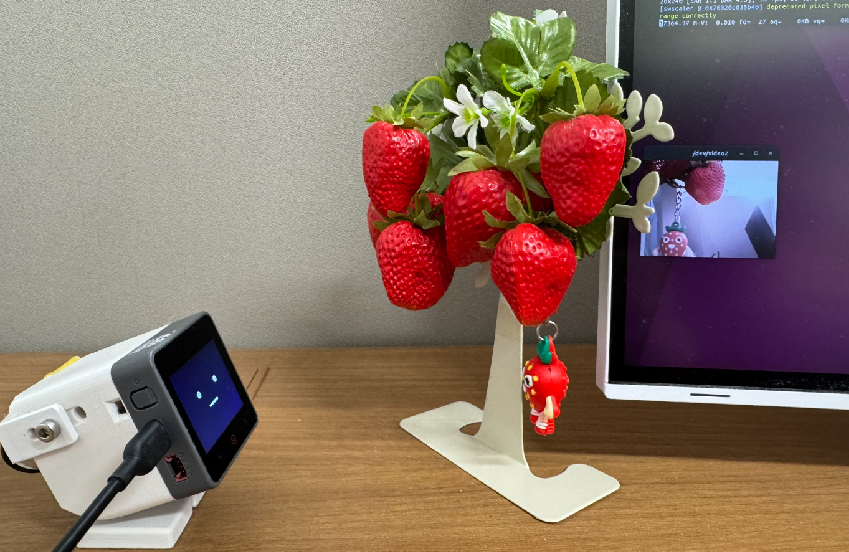

# WebcamChan
UVCカメラとして動作するM5StackCoreS3用ファームウェア（ｳｪﾌﾞｶﾑﾁｬﾝ）

M5StackCoreS3-embedded super-kawaii UVC device.



## 特徴

- 320x240(pixel)解像度のUVCデバイスとして動作
- カメラパラメータの一部は表情と連動 😑
- 無線設定が不要

## 環境構築＆ビルド

Linux環境を使用します。

### 環境

- Ubuntu 22.04 (6.8.0-90-generic x86_64 GNU/Linux)
- Docker 29.2.0

### ビルド

```bash
docker run --rm -v "$(pwd)":/project -w /project --env-file .env espressif/idf:v5.4.1 idf.py build
```

### ビルド&書き込み

```bash
docker run --rm -v "$(pwd)":/project -w /project --env-file .env --device=/dev/ttyACM0 espressif/idf:v5.4.1 idf.py -p /dev/ttyACM0 flash
```

またはReleaseページから以下のファイルをダウンロードして書き込みを行う。

- bootloader.bin
- partition-table.bin
- webcam_chan.bin

```bash
# インストール : sudo apt install -y esptool

esptool.py --chip esp32s3 --port /dev/ttyACM0 --baud 921600 \
  write_flash \
  0x0 bootloader.bin \
  0x8000 partition-table.bin \
  0x10000 webcam_chan.bin
```

> [!IMPORTANT]
> ファームウェア書き込み後のファームウェア更新は、リセットを5秒以上長押ししてファームウェア書き込みモードに遷移させる必要があります。

### カメラ起動

`/dev/video2` は接続されたカメラデバイスに置き換えてください。

```bash
ffplay -f v4l2 -input_format mjpeg -video_size 320x240 -framerate 30 /dev/video2
```

### 表情変更

`/dev/video2` は接続されたカメラデバイスに置き換えてください。

笑顔 😊

```bash
v4l2-ctl -d /dev/video2 --set-ctrl brightness=250
```

真顔

```bash
v4l2-ctl -d /dev/video2 --set-ctrl brightness=128
```

ガッカリ 😑

```bash
v4l2-ctl -d /dev/video2 --set-ctrl brightness=0
```
